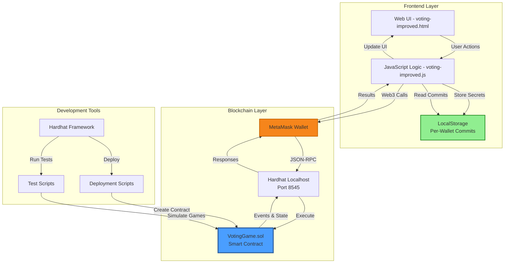
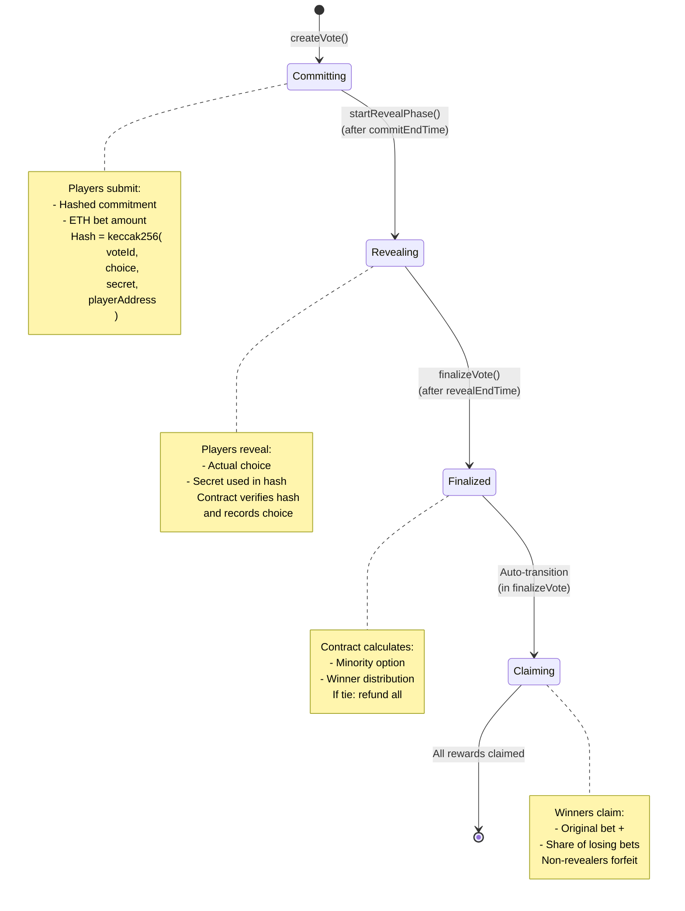
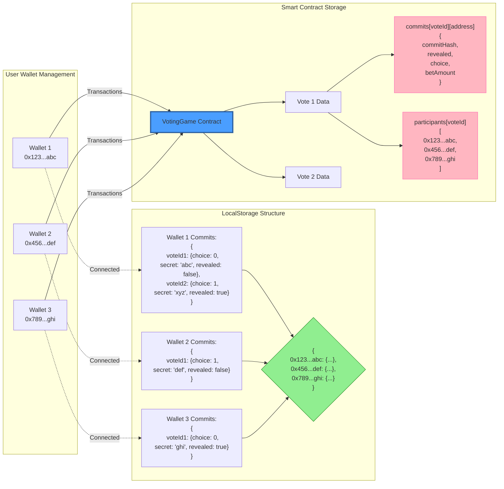
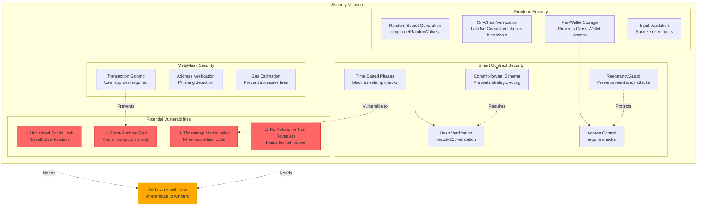
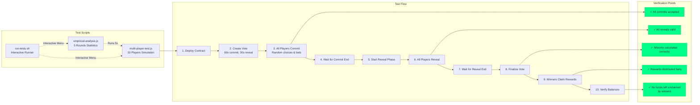
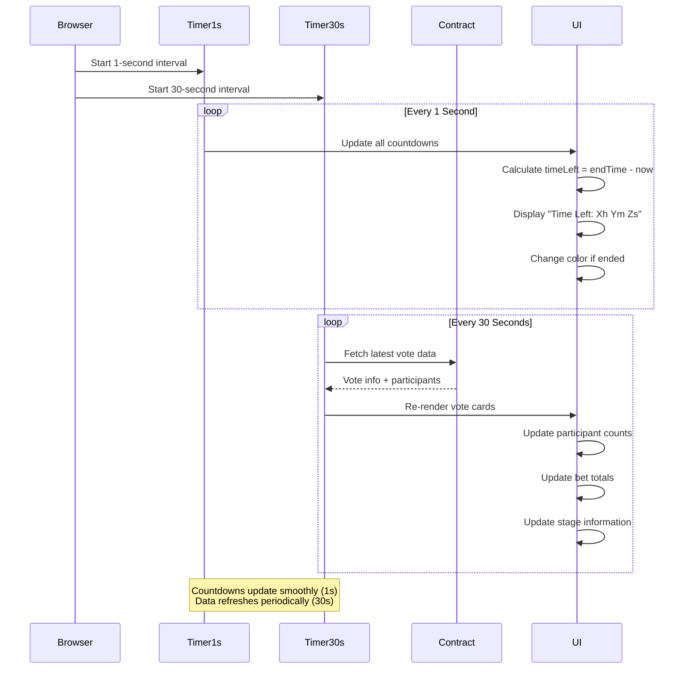
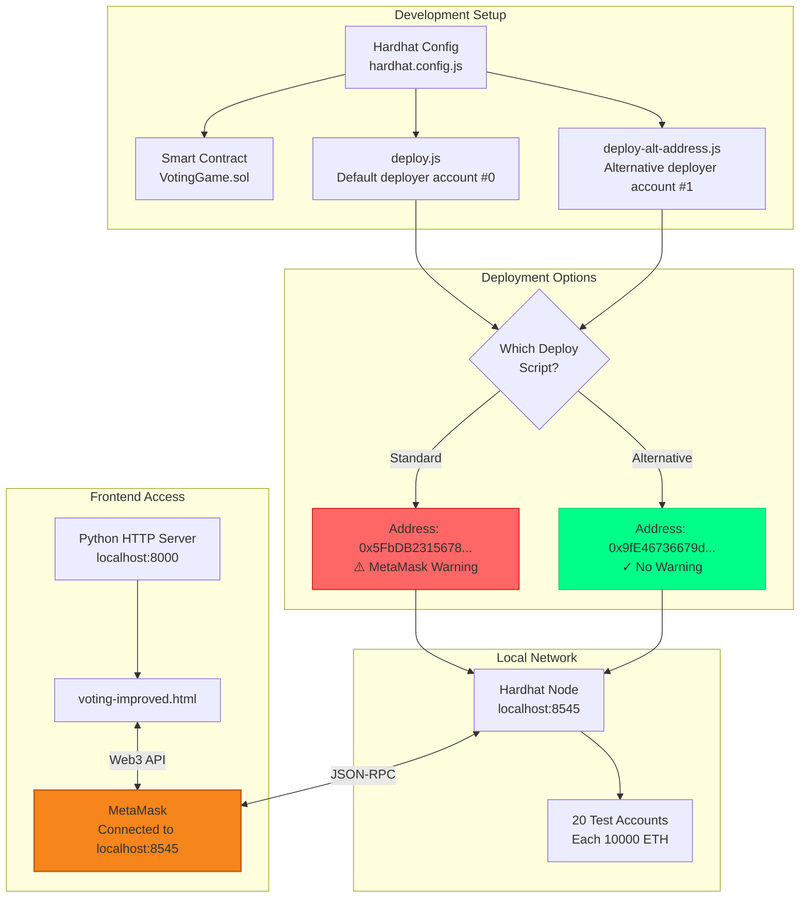

# Minority Game - System Architecture & Flow Charts

## Table of Contents
1. [System Architecture](#system-architecture)
2. [Smart Contract State Machine](#smart-contract-state-machine)
3. [Commit-Reveal Flow](#commit-reveal-flow)
4. [Component Interaction](#component-interaction)
5. [Data Flow](#data-flow)
6. [Security Architecture](#security-architecture)

---

## System Architecture



### Architecture Components

**Frontend Layer:**
- **Web UI**: Cyberpunk-themed interface with tabs for Active/History votes
- **JavaScript Logic**: Handles wallet connection, transaction signing, UI updates
- **LocalStorage**: Stores per-wallet commit secrets (choice + random secret)

**Blockchain Layer:**
- **MetaMask**: Browser wallet for signing transactions and managing accounts
- **Hardhat Localhost**: Local Ethereum node running on port 8545
- **Smart Contract**: Solidity contract implementing commit-reveal voting logic

**Development Tools:**
- **Hardhat Framework**: Development environment for compiling, deploying, testing
- **Deployment Scripts**: Scripts to deploy contracts with alternative addresses
- **Test Scripts**: Multi-player simulation scripts for testing game mechanics

---

## Smart Contract State Machine



### State Descriptions

| State | Duration | Actions Allowed | Purpose |
|-------|----------|----------------|---------|
| **Committing** | commitDuration (default 1h) | `commit()` | Players submit hashed commitments with ETH bets |
| **Revealing** | revealDuration (default 30m) | `reveal()` | Players reveal their choices with secrets |
| **Finalized** | Instant | None | Contract calculates minority option |
| **Claiming** | Unlimited | `claimReward()` | Winners withdraw rewards |

---

## Commit-Reveal Flow

```mermaid
sequenceDiagram
    participant User
    participant Frontend
    participant LocalStorage
    participant MetaMask
    participant Contract

    rect rgb(40, 40, 80)
        note right of User: COMMIT PHASE
        User->>Frontend: Select choice & bet amount
        Frontend->>Frontend: Generate random secret
        Frontend->>Frontend: Hash = keccak256(voteId, choice, secret, address)
        Frontend->>LocalStorage: Store {choice, secret, betAmount}
        Frontend->>MetaMask: Call commit(voteId, hash) + ETH
        MetaMask->>User: Confirm transaction
        User->>MetaMask: Approve
        MetaMask->>Contract: commit(voteId, hash) {value: bet}
        Contract->>Contract: Store commitHash & betAmount
        Contract->>Contract: Add to participants[]
        Contract-->>MetaMask: CommitSubmitted event
        MetaMask-->>Frontend: Transaction receipt
        Frontend-->>User: ✓ Commit successful
    end

    rect rgb(40, 60, 40)
        note right of User: REVEAL PHASE
        User->>Frontend: Click "Reveal Vote"
        Frontend->>LocalStorage: Retrieve {choice, secret}
        Frontend->>MetaMask: Call reveal(voteId, choice, secret)
        MetaMask->>User: Confirm transaction
        User->>MetaMask: Approve
        MetaMask->>Contract: reveal(voteId, choice, secret)
        Contract->>Contract: Verify hash matches commit
        Contract->>Contract: Record choice in optionTotals
        Contract-->>MetaMask: RevealSubmitted event
        MetaMask-->>Frontend: Transaction receipt
        Frontend->>LocalStorage: Mark as revealed
        Frontend-->>User: ✓ Reveal successful
    end

    rect rgb(60, 40, 40)
        note right of User: FINALIZE PHASE
        User->>Frontend: Click "Finalize Vote"
        Frontend->>MetaMask: Call finalizeVote(voteId)
        MetaMask->>Contract: finalizeVote(voteId)
        Contract->>Contract: Find minimum optionTotal
        Contract->>Contract: Set winningOption
        Contract->>Contract: Change stage to Claiming
        Contract-->>MetaMask: VoteFinalized event
        Frontend-->>User: ✓ Vote finalized
    end

    rect rgb(40, 40, 60)
        note right of User: CLAIM PHASE
        User->>Frontend: Click "Claim Reward"
        Frontend->>MetaMask: Call claimReward(voteId)
        MetaMask->>Contract: claimReward(voteId)
        Contract->>Contract: Calculate reward
        Contract->>Contract: reward = bet + (losingTotal × bet / winningTotal)
        Contract->>User: Transfer ETH reward
        Contract-->>MetaMask: RewardClaimed event
        Frontend-->>User: ✓ Reward claimed: X ETH
    end
```



---

## Component Interaction



### Multi-Wallet Support

**Problem Solved:** Each MetaMask wallet needs separate commit storage to prevent cross-contamination.

**Solution:** LocalStorage structure:
```javascript
{
  "0x123...abc": {
    "1": { choice: 0, secret: "random1", revealed: false, betAmount: "0.1" },
    "2": { choice: 1, secret: "random2", revealed: true, betAmount: "0.5" }
  },
  "0x456...def": {
    "1": { choice: 1, secret: "random3", revealed: false, betAmount: "0.2" }
  }
}
```

---

## Data Flow

```mermaid
flowchart TD
    Start([User Opens App]) --> CheckWallet{Wallet<br/>Connected?}

    CheckWallet -->|No| ConnectWallet[Click Connect Wallet]
    ConnectWallet --> MetaMask[MetaMask Popup]
    MetaMask --> CheckNetwork{Network<br/>Localhost?}
    CheckNetwork -->|No| SwitchNetwork[Switch to Localhost:8545]
    CheckNetwork -->|Yes| LoadData
    SwitchNetwork --> LoadData

    CheckWallet -->|Yes| LoadData[Load User Address]

    LoadData --> LoadLS[Load LocalStorage for Wallet]
    LoadLS --> LoadVotes[Fetch Active & History Votes]

    LoadVotes --> RenderUI[Render Vote Cards]

    RenderUI --> UserAction{User Action?}

    UserAction -->|Create Vote| CreateFlow[Create Vote Flow]
    UserAction -->|Commit| CommitFlow[Commit Flow]
    UserAction -->|Reveal| RevealFlow[Reveal Flow]
    UserAction -->|Finalize| FinalizeFlow[Finalize Flow]
    UserAction -->|Claim| ClaimFlow[Claim Flow]

    CreateFlow --> ContractCall1[Contract: createVote()]
    CommitFlow --> StoreSecret[Store choice+secret in LS]
    StoreSecret --> ContractCall2[Contract: commit()]
    RevealFlow --> ReadSecret[Read choice+secret from LS]
    ReadSecret --> ContractCall3[Contract: reveal()]
    FinalizeFlow --> ContractCall4[Contract: finalizeVote()]
    ClaimFlow --> ContractCall5[Contract: claimReward()]

    ContractCall1 --> WaitTx[Wait for Transaction]
    ContractCall2 --> WaitTx
    ContractCall3 --> WaitTx
    ContractCall4 --> WaitTx
    ContractCall5 --> WaitTx

    WaitTx --> TxSuccess{Success?}
    TxSuccess -->|Yes| RefreshUI[Refresh UI]
    TxSuccess -->|No| ShowError[Show Error]

    RefreshUI --> UserAction
    ShowError --> UserAction

    style Start fill:#00ff88,stroke:#00cc66,stroke-width:3px
    style LoadData fill:#4a9eff,stroke:#2d5f9f
    style LoadLS fill:#90ee90,stroke:#228b22
    style ContractCall1 fill:#ffaa00,stroke:#cc8800
    style ContractCall2 fill:#ffaa00,stroke:#cc8800
    style ContractCall3 fill:#ffaa00,stroke:#cc8800
    style ContractCall4 fill:#ffaa00,stroke:#cc8800
    style ContractCall5 fill:#ffaa00,stroke:#cc8800
```

---

## Security Architecture



### Security Analysis

**✅ Implemented Protections:**

1. **Commit-Reveal Scheme**: Prevents players from seeing others' choices before committing
2. **ReentrancyGuard**: Protects against reentrancy attacks in `commit()`, `reveal()`, `claimReward()`
3. **Hash Verification**: Ensures revealed choice matches committed hash
4. **Per-Wallet Storage**: Frontend prevents localStorage contamination between wallets
5. **On-Chain Verification**: Frontend checks blockchain state, not just localStorage

**⚠️ Known Vulnerabilities:**

1. **Unclaimed Funds Lock**:
   - Issue: No mechanism to recover funds from non-revealers
   - Impact: ETH accumulates in contract forever
   - Solution: Add owner withdrawal or distribute to winners

2. **Front-Running Risk**:
   - Issue: Commit transactions visible in mempool
   - Impact: Miners/bots could potentially exploit
   - Mitigation: Commit-reveal scheme limits this to timing attacks

3. **Timestamp Manipulation**:
   - Issue: Miners can adjust `block.timestamp` by ±15 seconds
   - Impact: Could slightly extend/shorten phases
   - Mitigation: Use longer phase durations (hours, not seconds)

4. **No Emergency Stop**:
   - Issue: No pause/emergency withdrawal mechanism
   - Impact: If bug found, funds are locked
   - Solution: Add pausable functionality or time-locked admin controls

---

## Testing Architecture



---

## Real-Time Updates Architecture



### Countdown System

**Implementation:**
- **1-second timer**: Updates countdown displays using client-side calculation
- **30-second timer**: Fetches fresh data from blockchain to detect phase changes
- **Data attributes**: `data-end-time` stores Unix timestamp for each countdown

**Benefits:**
- Smooth countdown without constant blockchain queries
- Detects when other players trigger phase transitions
- Low RPC call overhead (120 calls/hour vs 3600 calls/hour)

---

## Deployment Architecture



### Deployment Guide

**Problem:** MetaMask flags default Hardhat address `0x5FbDB2315678afecb367f032d93F642f64180aa3` as malicious.

**Solution:** Deploy using alternative account to generate different contract address.

```bash
# Option 1: Standard deployment (triggers warning)
npx hardhat run scripts/deploy.js --network localhost

# Option 2: Alternative deployment (no warning)
npx hardhat run scripts/deploy-alt-address.js --network localhost
```

**Result:** Contract deployed at safe address `0x9fE46736679d2d9a73f5829FC5fb3A7663Ef3fc1`

---

## Summary

This Minority Game voting system implements a decentralized commit-reveal voting mechanism with the following key features:

**Core Features:**
- ✅ Commit-reveal scheme prevents strategic voting
- ✅ Minority option wins and splits the losing bets
- ✅ Multi-wallet support with per-wallet localStorage
- ✅ Real-time countdown updates (1-second precision)
- ✅ Detailed voting history with all participants
- ✅ Participant list display during active voting

**Architecture Highlights:**
- Smart contract: Solidity with ReentrancyGuard protection
- Frontend: Vanilla JavaScript with Web3/Ethers.js integration
- Local blockchain: Hardhat localhost for development
- Wallet: MetaMask for transaction signing

**Security Considerations:**
- Protected against reentrancy attacks
- Commit-reveal prevents information leakage
- Hash verification ensures vote integrity
- Known issue: Unclaimed funds lock (requires contract upgrade)

**Testing:**
- Automated 10-player simulation script
- Statistical analysis over 5 rounds
- Interactive test runner for easy debugging
